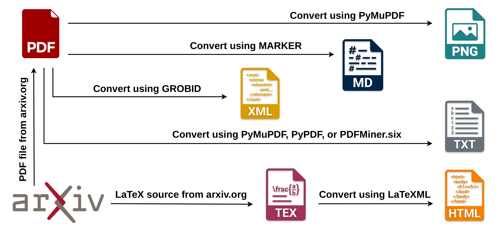

# arxiv-url-bench: Multi-Format Benchmark for URL Extraction from arXiv Papers

This repository contains the code used in our study on **URL Extraction from Scholarly PDFs: A Cross-Format Comparative Analysis**.

Scholarly documents contain URLs linking to datasets, software, publications, project websites, and other external resources. Although these links are essential for downstream tasks such as web crawling, link rot analysis, and knowledge graph construction, URL extraction is often treated as a simple preprocessing step using only a single document representation (typically text extracted from PDFs).

To investigate the impact of document representation, we evaluate URL extraction across six input formats derived from the same arXiv papers: PDF text with annotation layers (TEXTWAL), LaTeX source, HTML, XML/TEI, Markdown, and page images (PNG). We further evaluate 63 combinations of these formats to determine how complementary representations improve extraction performance.

The repository includes:
- the complete URL extraction and evaluation pipeline;
- scripts for generating and processing the different document representations;
- notebooks for reproducing the experiments and analyses;
- the evaluation framework used on a manually annotated benchmark of 200 arXiv papers (2,338 ground-truth URLs); and
- the large-scale longitudinal analysis over 364,744 arXiv papers (1992–2024).


The raw arXiv papers and large intermediate artifacts are **not** stored in this repository. See **[Getting the data](#getting-the-data)** for instructions on accessing the companion Hugging Face dataset.


---

## Contents

- [Overview](#overview)
- [Repository structure](#repository-structure)
- [Getting the data](#getting-the-data)
- [Environment setup](#environment-setup)
- [Notebooks](#notebooks)
- [Notebook execution order](#notebook-execution-order)
- [Results and figures](#results-and-figures)
<!-- - [Citation](#citation)
- [License](#license) -->
<!-- - [Acknowledgments](#acknowledgments) -->

---

## Overview



Twelve independent extraction pipelines are run over the same set of papers:

| Format | Tool(s) |
|---|---|
| Text (plain) | PyMuPDF |
| TEXTWAL — Text + annotation layer | PyMuPDF |
| TEXTWAL — Text + annotation layer | PyPDF |
| TEXTWAL — Text + annotation layer | pdfminer.six |
| TEXTWAL-CL — Text + annotation layer, LLM-assisted | Claude (Anthropic API) |
| LaTeX source | pylatexenc + regex |
| HTML | LaTeXML → BeautifulSoup |
| XML (TEI) | GROBID → lxml |
| PNG (page images), VLM-assisted | Qwen2-VL-7B-Instruct |
| PNG (page images), VLM-assisted | DeepSeek-VL-7B-Chat |
| PNG (page images), VLM-assisted | MiniCPM-o-2_6 |
| Markdown | Marker |

**TEXTWAL** = "Text With Annotation Layer": beyond visible text, it also pulls in PDF annotations, optional-content-group (hidden) layers, document metadata, and a raw byte-level scan.

Two datasets are built on top of this pipeline:

1. **The 200-paper benchmark** — a stratified sample (Set A: 2016–2024, Set B: 1992–2015; 100 papers each), balanced across single-column, double-column, ETD, and scanned layouts, filtered to successful conversion into every format. Every URL was **manually annotated** with its location in the paper, lexicographical/spatial/representational complexity, and an **OADS** category — `TPD` (Third-Party Dataset), `TPS` (Third-Party Software), `APD` (Author-Provided Dataset), `APS` (Author-Provided Software), `Project`, or `GenURL` (general/other) — giving 2,420 total URLs (2,338 unique).
2. **The 360k longitudinal corpus** — a stratified sample of ~467K PDFs (up to 15,000/year, 1992–2024) narrowed to the **364,744 papers** for which all six formats (PDF/TEXTWAL, LaTeX, HTML, XML, Markdown) were successfully produced, used to track extraction coverage over time.

## Repository structure

```
.
├── 1_arxiv_200_benchmark_conversions_and_extractions.ipynb
├── 2_arxiv_200_all_urls_extraction_performance.ipynb
├── 3_arxiv_200_oads_urls_extraction_performance.ipynb
├── 4_arxiv_urls_longitudinal_analysis.ipynb
├── README.md
│
├── requirements/                  # one requirements file per (conflicting) environment — see below
│   ├── requirements_core.txt
│   ├── requirements_marker.txt
│   ├── requirements_vlm_qwen.txt
│   ├── requirements_vlm_deepseek.txt
│   └── requirements_vlm_minicpm.txt
│
├── scripts/                       # SLURM job scripts + the Python scripts they call; invoked FROM the notebooks
│   ├── benchmark_200/              #   used by notebooks 1, 2, 3
│   └── longitudinal_analysis/      #   used by notebook 4
│
├── results/                       # pre-generated output figures (PDF) — reproduced by notebooks 2 & 3
│
├── data/
│   ├── 200_sample/                 # ground truth + sampling metadata (in repo); raw papers via Hugging Face
│   │   └── README.md               # download instructions + expected directory layout
│   └── la_360k_sample/             # entirely via Hugging Face (too large for git)
│       └── README.md               # download instructions + expected directory layout
│
└── documents/                     # supplementary materials
```

You do not need to run anything in `scripts/` directly — each notebook's **Conversion** / **Extraction** cells tell you exactly which script to submit (`sbatch scripts/.../stage_X.sh`) and where to find its output before you continue to the next cell.

## Getting the data

None of the raw PDFs, LaTeX sources, or large intermediate JSON files are checked into this repository. Both datasets are hosted on Hugging Face:

**https://huggingface.co/datasets/dblind-data/arxiv-url-bench-hf**

| | Size | Needed for | Download instructions |
|---|---|---|---|
| **200-paper benchmark raw files** (PDF + LaTeX source) | ~2.8 GB | Notebook 1 | [`data/200_sample/README.md`](data/200_sample/README.md) |
| **200-paper ground truth CSV & superset JSON** | ~10 MB | Notebooks 2 & 3 | already in this repo under `data/200_sample/`; superset JSON is generated by notebook 2 |
| **360k longitudinal corpus** (6 raw formats, `.tar.gz` each) | ~560 GB total | only if rerunning the longitudinal preprocessing pipeline | [`data/la_360k_sample/README.md`](data/la_360k_sample/README.md) |
| **360k extracted-URLs JSON** (`arxiv_extracted_urls_5_formats_360k.json`) | ~690 MB | Notebook 4 (this is the *only* file you need to reproduce its final figure) | [`data/la_360k_sample/README.md`](data/la_360k_sample/README.md) |

Each `data/*/README.md` has the exact directory layout the corresponding notebook expects — download the relevant archive(s) from Hugging Face, extract, and place the contents as shown there before running the notebook.

## Environment setup

Several formats need **conflicting** package versions (e.g. different `torch` builds per VLM) and cannot share one Python environment. Create a dedicated virtual environment / conda environment per row below before running that section of a notebook:

| Environment | Requirements file | Used by |
|---|---|---|
| Core | `requirements/requirements_core.txt` | Text, all TEXTWAL variants, LaTeX, HTML, XML, and the final JSON merge (notebook 1); all of notebooks 2 & 3 |
| Marker | `requirements/requirements_marker.txt` | Markdown (PDF → Markdown) section |
| VLM — Qwen | `requirements/requirements_vlm_qwen.txt` | Qwen2-VL-7B-Instruct section |
| VLM — DeepSeek | `requirements/requirements_vlm_deepseek.txt` | DeepSeek-VL-7B-Chat section |
| VLM — MiniCPM | `requirements/requirements_vlm_minicpm.txt` | MiniCPM-o-2_6 section|

Additional, non-pip dependencies pulled in by specific sections:

- **LaTeXML** (HTML section, both notebooks 1 & 4) — Docker/Apptainer image `latexml/ar5ivist:latest`.
- **GROBID** (XML section) — notebook 1 uses the public demo endpoint (`kermitt2-grobid.hf.space`) since it only processes 200 papers; notebook 4 self-hosts `grobid/grobid:0.9.0-full` via Docker/Apptainer for the 360k-paper scale.
- **Claude (Anthropic API)** (TEXTWAL-CL section, notebook 1) — add a `.env` file at the repository root:
  ```
  ANTHROPIC_API_KEY=your-key-here
  ```
- **Qwen2-VL / DeepSeek-VL / MiniCPM-o model weights** — downloaded on first run via `huggingface_hub.snapshot_download` into `VLMs/<model_name>/`; expect multi-GB downloads per model.
- **SLURM** — the conversion/extraction steps for HTML, XML, Markdown, and all VLM passes, plus the entire longitudinal (360k) pipeline, are written as `sbatch` jobs for an HPC cluster. If you don't have SLURM, the referenced `scripts/**/*.py` files can be run directly (see the `.sh` wrapper for the expected arguments).

## Notebooks

### 1 — [`1_arxiv_200_benchmark_conversions_and_extractions.ipynb`](1_arxiv_200_benchmark_conversions_and_extractions.ipynb)
*"URL Extraction Across Document Formats"*

For each of the 12 format/tool combinations in the [overview table](#overview), this notebook runs: **Env setup** → **Conversion** (source → target format) → **Extraction** (regex/parser/model → URL list). It finishes by merging every format's per-paper results into one combined JSON.

- **Requires:** `data/200_sample/raw_files/pdf/` and `data/200_sample/raw_files/latex/` populated from the Hugging Face download (see [`data/200_sample/README.md`](data/200_sample/README.md)).
- **Produces:** `data/200_sample/intermediate_results/stage_*.json` (one per format) and the combined `data/200_sample/arxiv_extracted_urls_all_formats_200.json`.
- Section order mirrors the table above: Text → TEXTWAL (PyMuPDF/PyPDF/pdfminer.six) → TEXTWAL-CL (Claude) → LaTeX → HTML → XML (GROBID) → VLM (PNG → Qwen2-VL / DeepSeek-VL / MiniCPM-o) → Markdown (Marker) → combine.

### 2 — [`2_arxiv_200_all_urls_extraction_performance.ipynb`](2_arxiv_200_all_urls_extraction_performance.ipynb)
*"All-URLs Extraction Performance — 200-Paper Sample"*

Evaluates how well each of the 6 single-format extractors — and every one of the **63** non-empty combinations of them — recovers the full set of human-labelled ground-truth URLs.

- **Requires:** notebook 1's output JSON, plus `data/200_sample/arxiv_urls_1992_2024_gt.csv` (already in this repo).
- **Produces:** `data/200_sample/analysis/arxiv_extracted_unique_urls_all_200_superset.json` (**required input for notebook 3**), plus `url_format_availability.csv`, `all_urls_63_combos.csv`, `friedman_all_url_recall.csv`, `significance_all_url_recall_holm.csv`, and figures in `results/`.
- **What it covers:** (1) ground-truth characterization (where URLs appear, their complexity); (2) domain- and protocol-level coverage per format; (3) bootstrapped (B=10,000) Recall/Precision/F1 with 95% CIs across all 63 format combinations; (4) a Friedman test for a global difference across the 6 formats, followed by (5) pairwise Wilcoxon signed-rank tests with Holm–Bonferroni correction against the best single-format baseline.

### 3 — [`3_arxiv_200_oads_urls_extraction_performance.ipynb`](3_arxiv_200_oads_urls_extraction_performance.ipynb)
*"OADS URL Extraction Performance — 200-Paper Sample"*

Same experimental design as notebook 2, but narrowed to just the **OADS-labelled** URLs (`TPD`/`TPS`/`APD`/`APS`/`Project`, excluding `GenURL`) — i.e., does a given format (combination) specifically recover links to datasets, software, and project pages, as opposed to general references?

- **Requires:** the superset JSON produced by notebook 2 — **run notebook 2 first.**
- **Produces:** OADS category distribution, bootstrapped OADS Recall (B=10,000) across all 63 combinations, the same Friedman/Wilcoxon/Holm–Bonferroni significance tests, and a breakdown of which paper sections / complexity types are most often missed, per format.

### 4 — [`4_arxiv_urls_longitudinal_analysis.ipynb`](4_arxiv_urls_longitudinal_analysis.ipynb)
*"Temporal Distribution of Extracted URLs from arXiv Papers (1992–2024)"*

Documents the full preprocessing pipeline used to go from an initial stratified sample of ~467K PDFs (1992–2024) down to the 364,744-paper common pool with all 6 formats successfully produced, then reproduces the temporal-distribution figure.

- **Fully independent of notebooks 1–3.**
- **To just reproduce the final figure**, you don't need to rerun the pipeline — only `data/la_360k_sample/arxiv_extracted_urls_5_formats_360k.json` is required (see [`data/la_360k_sample/README.md`](data/la_360k_sample/README.md)) and you can skip straight to the notebook's **"Reproducing Figure 7"** section.
- The earlier cells (sampling → TEXTWAL → LaTeX → XML/GROBID → Markdown/Marker → HTML/LaTeXML → merge) document, stage by stage, how that final JSON was built from raw PDFs at HPC scale, and are kept for transparency/reproducibility rather than for interactive re-execution.

## Notebook execution order

```
1_arxiv_200_benchmark_conversions_and_extractions.ipynb
        │  writes: data/200_sample/arxiv_extracted_urls_all_formats_200.json
        ▼
2_arxiv_200_all_urls_extraction_performance.ipynb
        │  writes: data/200_sample/analysis/arxiv_extracted_unique_urls_all_200_superset.json
        ▼
3_arxiv_200_oads_urls_extraction_performance.ipynb

4_arxiv_urls_longitudinal_analysis.ipynb   — independent; only needs the 360k Hugging Face download
```

Notebooks 1 → 2 → 3 must run in that order the first time (each reads a file the previous one wrote); notebook 4 can be run any time on its own once its data is downloaded.

## Results and figures

`results/` contains the PDF figures the notebooks produce (regenerate by rerunning notebooks 2 & 3):

| File | From | Shows |
|---|---|---|
| `url_complexity_location_spatial.pdf` | Notebook 2 | Where ground-truth URLs appear in a paper, and their lexicographical/spatial complexity |
| `domain_coverage.pdf` | Notebook 2 | Per-format extraction coverage for the top URL domains |
| `protocol_coverage.pdf` | Notebook 2 | Per-format extraction coverage by URI scheme (http/https/ftp/…) |
| `all_valid_urls_recall_63_combinations.pdf` | Notebook 2 | Bootstrapped All-URLs Recall across all 63 format combinations |
| `all_urls_f1_63_combinations.pdf` | Notebook 2 | Bootstrapped All-URLs F1 across all 63 format combinations |
| `oads_distribution.pdf` | Notebook 3 | Distribution of ground-truth URLs across OADS categories |
| `oads_recall_63_combinations.pdf` / `all_valid_OADS_urls_recall_63_combinations.pdf` | Notebook 3 | Bootstrapped OADS Recall across all 63 format combinations |

<!-- ## Citation

A citation for the accompanying paper will be added here once available.  -->
<!-- 
> *arXiv URL Extraction Benchmark & Longitudinal Multi-Format Corpus*, `dblind-data/arxiv-url-bench-hf`, Hugging Face Datasets, 2026. https://huggingface.co/datasets/dblind-data/arxiv-url-bench-hf -->

<!-- ## License

The companion Hugging Face dataset is released under **CC BY 4.0**. This repository does not currently include a code license file — if you plan to reuse or redistribute the code, add one (e.g., MIT, Apache-2.0, BSD-3-Clause) to make the terms explicit. -->

## Acknowledgments

This project builds on a number of open-source and third-party tools: [PyMuPDF](https://github.com/pymupdf/PyMuPDF), [pypdf](https://github.com/py-pdf/pypdf), [pdfminer.six](https://github.com/pdfminer/pdfminer.six), [GROBID](https://github.com/kermitt2/grobid), [LaTeXML](https://github.com/brucemiller/latexml), [Marker](https://github.com/datalab-to/marker), [Qwen2-VL](https://huggingface.co/Qwen/Qwen2-VL-7B-Instruct), [DeepSeek-VL](https://github.com/deepseek-ai/DeepSeek-VL), [MiniCPM-o](https://huggingface.co/openbmb/MiniCPM-o-2_6), and the [Anthropic API](https://www.anthropic.com) (Claude), as well as [arXiv](https://arxiv.org) itself for hosting the underlying papers.


```
Rochana Obadage
07/09/2026
```